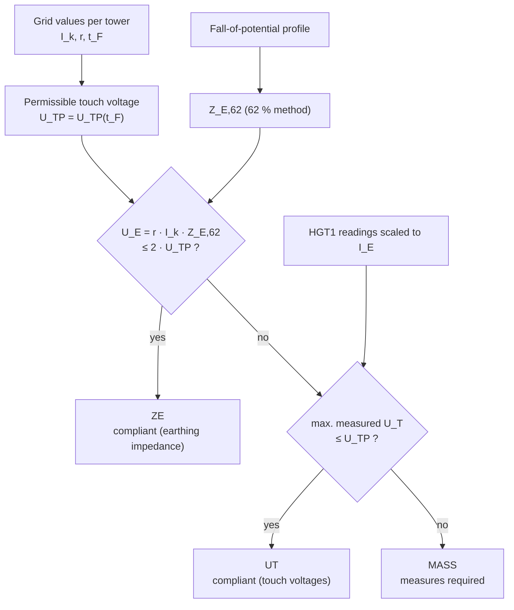

# Assessment procedure

This page lists the rules the `--calc` step of `gm-cli towers run` applies to
every tower. The
physics behind them is explained in [Physical background](physics.md).

## 1. Grid values

For every tower the tool determines (see
[Preparing a campaign](campaign.md#grid-data-grid_dataxlsx) for
the priorities between the sources):

| Quantity | Symbol | Sources |
| --- | --- | --- |
| short-circuit current | $I_k$ | flat value per line · short-circuit line model · grid-data workbook · configuration default |
| reduction factor | $r$ | flat value per line · grid-data workbook · configuration default |
| fault clearing time | $t_F$ | position on the line · grid-data workbook · configuration default |

The earth current is $I_E = r \cdot I_k$.

### Fault clearing time

With `line_protection.enabled`, the clearing time follows from the position
of the tower on its line (`Leitungsschutz` sheet):

$$
\text{position} = \frac{n - n_{first}}{n_{last} - n_{first}} \cdot 100\,\%
$$

with the tower number $n$ and the first and last tower number of the line
($n_{first}$ = `Mast_Anfang`, $n_{last}$ = `Mast_Ende`).

| Case | Clearing time | Zone (`ProtectionResult.zone`) |
| --- | --- | --- |
| `Schnellzeit_von_Prozent` ≤ position ≤ `Schnellzeit_bis_Prozent` (default 16 … 84 %) | `t_Schnellzeit_s` | `Schnellzeit` |
| position outside this band, or outside 0 … 100 % | `t_Endbereich_s` | `Endbereich` |
| `t_Schnellzeit_s` = `t_Endbereich_s` | that time | `pauschal` (flat) |
| position unknown (no tower range) | the longer of both times | `unbekannt` |

The explanation is written to the protocol, e.g. *"Position 17.9 % of the line
length: instantaneous tripping from both line ends (distance protection)"*.

## 2. Permissible touch voltage

$U_{TP}$ is interpolated linearly in the configured table at $t_F$. Times
outside the table use the value at the nearest end and log a warning.

## 3. Earthing impedance criterion (`ZE`)

The tower is compliant without considering the measured touch voltages if

$$
U_E = I_E \cdot Z_{E,62} \le 2\,U_{TP}
\quad\Longleftrightarrow\quad
Z_{E,62} \le \frac{2\,U_{TP}}{I_E}
$$

This follows the design procedure of EN 50522 and EN 50341-1: the touch
voltage is always only a part of the earth potential rise, so an earth
potential rise of at most twice the permissible touch voltage is accepted
without further proof.

## 4. Touch-voltage criterion (`UT`)

Otherwise the measured touch voltages decide. Every HGT1 reading is scaled to
the earth current, $U_T = U_{T,meas} \cdot I_E / I_{meas}$, and the highest
value of the selected subset (`touch_voltage_evaluation`: readings with
additional resistor by default) is compared with $U_{TP}$:

$$
U_{T,max} \le U_{TP}
$$

## Categories

| Code (`Bewertung_Kategorie`) | Condition | Verdict in the protocol |
| --- | --- | --- |
| `ZE` | $Z_{E,62} \le 2\,U_{TP} / I_E$ | *The earthing-impedance measurement shows that the touch voltage is below the permissible touch voltage. No further measures are required.* |
| `UT` | criterion 3 not met, $U_{T,max} \le U_{TP}$ | *The touch-voltage measurements at selected points show that the highest expected touch voltage is below the permissible touch voltage. No further measures are required.* |
| `MASS` | both criteria not met | *The touch voltages exceed the permissible values. Further measures are required.* |

`MASS` stands for German *Maßnahmen* (measures). Possible measures are, for
example, potential grading, insulating the standing surface, improving the
tower earthing or reducing the clearing time – the choice is an engineering
decision outside the scope of this tool.

## Footing resistance shown in the protocol

| Situation | Value shown |
| --- | --- |
| profile valid, no high-frequency value | $R_{A,62}$ from the profile |
| profile valid, high-frequency value deviates ≤ 20 % | $R_{A,62}$ from the profile |
| profile valid, high-frequency value deviates > 20 % | high-frequency value, with a note |
| no valid profile (`Messung_RA_Profil_bool` = 0 or profile unusable) | high-frequency value, with a note, or "not measured" |

The footing resistance does not enter the assessment.

## Worked example

Tower 3 of the demo campaign (`--demo`):

| Step | Value |
| --- | --- |
| position on the line | (3 − 1) / (40 − 1) = 5.1 % → end zone |
| clearing time $t_F$ | 0.4 s |
| permissible touch voltage $U_{TP}(0.4\,\text{s})$ | 300 V |
| short-circuit current $I_k$ (line model) | 12.73 kA |
| earth current $I_E = 0.66 \cdot 12.73$ kA | 8.40 kA |
| earthing impedance $Z_{E,62}$ | 0.552 Ω |
| earth potential rise $U_E = I_E \cdot Z_{E,62}$ | 4.64 kV > 2 · 300 V → criterion 3 not met |
| highest touch voltage (with additional resistor) | 420 V > 300 V → criterion 4 not met |
| result | `MASS` – measures required |

For comparison, tower 8 lies at 17.9 % (instantaneous tripping, 0.1 s,
$U_{TP}$ = 633 V): $U_E$ = 0.66 · 11.2 kA · 0.121 Ω = 0.89 kV ≤ 1.27 kV, so it
is compliant by the earthing-impedance criterion (`ZE`).
