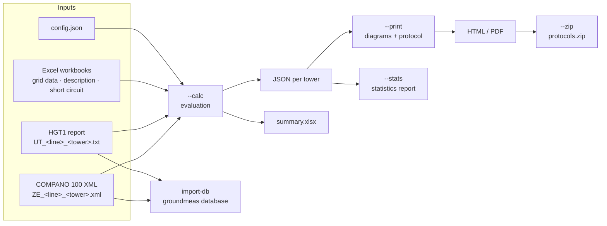

# Tower campaigns

**Evaluate earthing measurements of overhead-line towers.**

`gm-cli towers` turns the raw files of an earthing measurement campaign into
an assessment of every tower and a ready-to-sign protocol:

- reads **OMICRON COMPANO 100** fall-of-potential exports (XML) and
  **OMICRON HGT1** touch-voltage reports (text),
- determines the **earthing impedance** with the 62 % method, the **footing
  resistance**, the **touch voltages** at the earth-fault current and the
  **step-voltage** profile,
- derives the **fault current** per tower from a short-circuit line model and
  the **fault clearing time** from the position of the tower on the line,
- checks every tower against the **permissible touch voltage**
  (EN 50522 / EN 50341) and classifies it,
- writes a **JSON file per tower**, an **Excel summary**, **HTML/PDF
  protocols** (English or German), a **ZIP archive** and an optional
  **statistics report** over all towers,
- copies the instrument data into the **groundmeas database** on request
  (`gm-cli towers import-db`), where the dashboard, the map and all analytics
  of groundmeas are available.

The tower workflow was developed as the separate package
`tower-grounding-measurement` and is part of groundmeas since 2026-10; see
[Migration](migration.md) if you used the old package.

<div class="grid cards" markdown>

-   :material-rocket-launch: **[Quickstart](quickstart.md)**

    Generate a synthetic demo campaign and evaluate it in two commands.

-   :material-folder-table: **[Preparing a campaign](campaign.md)**

    File names, Excel workbooks and the configuration of a real campaign.

-   :material-database-import: **[Campaigns in the database](database.md)**

    One location per tower, one measurement per test – for the dashboard and
    the groundmeas analytics.

-   :material-sine-wave: **[Physical background](physics.md)**

    Fall-of-potential method, touch voltage, permissible limits and the
    short-circuit model.

</div>

## At a glance

```console
$ pip install "groundmeas[pdf]"
$ gm-cli towers install-browser          # once, for PDF protocols
$ gm-cli towers demo demo
$ gm-cli towers run --config demo/config.json
```

The last command evaluates all towers (`--calc`), draws the diagrams and
prints one protocol per tower (`--print`) and packs the PDF files into one
archive (`--zip`).



## Installation

The tower workflow is part of every groundmeas installation. Only the PDF
protocols need an extra:

```console
$ pip install "groundmeas[pdf]"          # adds Playwright
$ gm-cli towers install-browser          # downloads Playwright's Chromium (~150 MB)
```

`install-browser` runs `python -m playwright install chromium` with the Python
interpreter of the installation, so it also works for isolated installations
(`pipx`, `uv tool`). Behind a restrictive proxy the download may fail; an
installed **Google Chrome** or **Microsoft Edge** is then used automatically,
or name a Chromium-based browser in the environment variable
`GROUNDMEAS_BROWSER` (a Playwright channel such as `chrome` or `msedge`, or the
path of an executable). Without any browser, `--no-pdf` writes the protocols
as HTML.

!!! note "Linux"

    Playwright's Chromium needs a few system libraries. On Debian/Ubuntu
    install them together with the browser:
    `python -m playwright install --with-deps chromium` (as root).

## Scope and limitations

The tool supports the engineer who assesses the measurements; it does not
replace the assessment. Check in particular

- the **permissible touch-voltage curve** in the configuration against the
  edition of EN 50522 / EN 50341 and the national annex you apply,
- the **fault currents, reduction factors and clearing times**, which come
  from your grid data and protection settings,
- the plausibility of every measurement (the protocols show the complete
  profiles for this purpose).

See [Physical background](physics.md#assumptions-and-limitations) for the
model assumptions.
