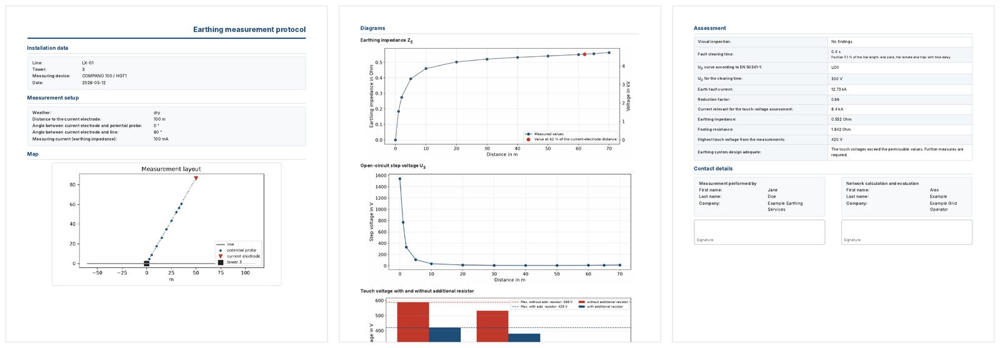

# Quickstart

This page evaluates a complete **synthetic demo campaign** in a few minutes.
The demo contains four towers of the fictitious line `LX-01`, generated from
simple physical models, so you can try every feature without real data.

## 1. Create the demo campaign

```console
$ gm-cli towers demo demo
INFO    Demo campaign written to demo
INFO    Run it with: gm-cli towers run --config demo/config.json
```

Use `--language de` for a German campaign (configuration, location names and
protocols in German). The folder now contains

```text
demo/
├── config.json                    campaign configuration (relative paths)
├── grid_data.xlsx                 fault current, reduction factor, clearing time per tower
├── measurement_description.xlsx   one row per measured tower
├── short_circuit_data.xlsx        short-circuit currents along the line + line protection
└── measurements/
    ├── ZE_LX-01_3.xml             COMPANO 100 fall-of-potential export
    ├── UT_LX-01_3.txt             HGT1 touch-voltage report
    ├── Map_LX-01_3.png            map image for the protocol
    ├── ...                        the same for towers 8, 21 and 37
    ├── ZE_LX-01_8_spez.Erdw..xml  soil-resistivity measurement
    └── UT_LX-01_8-9.txt           touch voltage measured at the neighbouring tower 9
```

[Preparing a campaign](campaign.md) explains every file.

## 2. Evaluate it

```console
$ gm-cli towers run --config demo/config.json
INFO    Using configuration /home/me/demo/config.json
INFO    --- calc ---
INFO    --- print ---
INFO    --- zip ---
```

Without a step option the three steps `--calc`, `--print` and `--zip` run in
this order. Add `--no-pdf` if Playwright or a browser is not installed yet;
the protocols are then written as HTML only. The `towers` commands work on
files; they do not open the groundmeas database.

## 3. Look at the results

```text
demo/results/
├── LX-01_3.json … LX-01_8.json    one result file per tower
├── summary.xlsx                    one row per tower
├── protocols.zip                   all PDF protocols
└── html_files/
    ├── LX-01_3.html / .pdf         protocol of tower 3
    ├── ZE_LX-01_3.png              earthing impedance and earth potential
    ├── RA_LX-01_3.png              footing resistance
    ├── US_LX-01_3.png              step voltage
    ├── UTbar_LX-01_3.png           touch voltages per measuring point
    └── Map_LX-01_3.png             copied map image
```



The four towers were chosen to show all outcomes of the assessment:

| Tower | Position | Clearing time | $U_{TP}$ | $Z_{E,62}$ | $U_{T,max}$ | Result |
| --- | --- | --- | --- | --- | --- | --- |
| 3 | 5.1 % (end zone) | 0.4 s | 300 V | 0.552 Ω | 420 V | `MASS` – measures required |
| 8 | 17.9 % (middle) | 0.1 s | 633 V | 0.121 Ω | 95 V | `ZE` – compliant by earthing impedance |
| 21 | 51.3 % (middle) | 0.1 s | 633 V | 0.602 Ω | 310 V | `UT` – compliant by measured touch voltages |
| 37 | 92.3 % (end zone) | 0.4 s | 300 V | 0.352 Ω | 261 V | `UT` – compliant by measured touch voltages |

- **Tower 8** has a low earthing impedance: even the full earth potential rise
  $U_E = r \cdot I_k \cdot Z_E$ stays below $2\,U_{TP}$.
- **Towers 21 and 37** have a higher earth potential rise, but every measured
  touch voltage (scaled to the earth-fault current) is permissible.
- **Tower 3** lies in the end zone of the line: the remote relay trips with
  time delay (0.4 s), the permissible touch voltage drops to 300 V and the
  measured 420 V exceed it.
- **Tower 21** also shows the choice of the footing resistance: the
  high-frequency single value from the measurement description (3.6 Ω)
  differs by more than 20 % from the fall-of-potential value, so the protocol
  shows the single value and says so.

[Results](results.md) documents every field of the JSON files and the content
of the protocol, [Assessment procedure](assessment.md) the decision rules.

## 4. Statistics over all towers (optional)

```console
$ gm-cli towers run --config demo/config.json --stats
```

writes `demo/results/Statistik/Asset_Auswertung.html` and `.pdf` with
distributions, exceedances per line and correlations (the texts of this
report are German).

## 5. Copy the campaign into the database (optional)

```console
$ gm-cli --db demo.db towers import-db --config demo/config.json
$ gm-cli --db demo.db list-measurements
$ gm-cli --db demo.db dashboard
```

creates one location per tower and one measurement per test, see
[Campaigns in the database](database.md).

## Next steps

- [Prepare your own campaign](campaign.md)
- [Configuration reference](configuration.md)
- [Use the tower workflow from Python](python.md)
